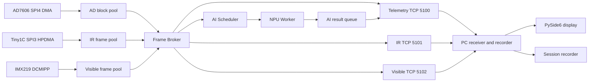

# STM32N6 连续多模态传输与上位机实施方案

日期：2026-07-18  
适用工程：`variants/fsbl_appli_all`  
当前基线分支：`codex/fsbl-appli-all-tiny1c-20fps-stable-20260718`

本文件是 `MULTIMODAL_ARCHITECTURE_PLAN_20260710.md` 的连续流落地方案，重点描述 N6 固件和电脑上位机如何分阶段实现红外、可见光、AD7606 和 AI 结果的持续传输、显示与录制。

## 实施状态

截至 2026-07-18，阶段 0 和阶段 1 的第一条链路已经落地：

- 已实现 64-byte 固定头的 `MMS2 V2` 编码和双 CRC32；
- 已增加 `TCP 5100` 独立遥测服务；当前发送模型实际使用的 `8×1024×S16` AD 窗口和 AI 结果原子组合包；
- 遥测服务使用独立 24-packet NetX 发送池，不占用控制服务 packet pool；
- 已增加 `STREAM LIST` 和 `STREAM STAT` 控制命令；
- 已增加 PC 命令行接收、CRC/序号检查、速率统计和原始流录制工具；
- 首次板端短测收到 105 个 AD 块和 11 个 AI 结果，线速约 `3.3 Mbps`，序号缺口、payload/header CRC 和协议错误均为零；测试被手动中断，仍需完成 60 秒回归和 30 分钟连续验收；
- 分离发送 AD 和 AI 的实测表明固定优先级无法同时满足两者：发送优先会使 AI 降至约 `0.5 次/s`，AI 优先会使 AD 发布降至约 `18 块/s`；当前改为 AD DMA 独立、AI Pipeline 优先级 `15`、bundle telemetry 优先级 `16`，每次只发送已完成推理的精确输入窗口和结果；
- 两轮连续 60 秒背压回归均收到 `828` 个 AD+AI 原子组合包，累计正好 `1656` 包，稳定约 `13.8 包/s`、`1.8 Mbps`；`bundle_gap=0`，CRC、协议、连接、分配和发送错误均为零，NetX 专用池最低剩余 `17/24`；
- 连接期间 AI 与组合包速率自动同步；第二轮结束后独立 10 秒窗口内 `runs` 增加 `163`、`bundle_wait` 保持不变，证明断开后背压已解除。当前 Tiny1C 20 fps、AD7606 和网络并行满载时，AI 独立实测速率约 `16.3 次/s`，低于配置目标 `25 次/s`；
- 红外 `TCP 5101`、可见光 `TCP 5102` 和图形上位机仍按后续阶段实施。

具体协议见 `STREAMING_PROTOCOL_V2.md`。

## 1. 当前基线

当前已经验证：

- RTL8211F 建立 `1000M-FD` 链路；
- no-fill 实测约 TCP `180～225 Mbps`、UDP `225～280 Mbps`；
- Tiny1C 使用 SPI3 50 MHz、HPDMA1 RX/TX High，可连续输出温度帧 `20 fps`；
- Tiny1C 30 分钟测试中自动挂起恢复 186 次，采集错误和 DMA timeout 均为零；
- AD7606 通过 SPI4 DMA 连续采集，约 `44～50` 个 8240-byte 数据块每秒；
- 当前 AD7606 AI 模型运行在 NPU 800 MHz，实际约 `17 次/秒`，单次通常为数毫秒；
- IMX219 已完成 640×480 RGB565 连续采集验证，但仍是内部 SRAM 单帧缓冲，`CAMGET` 通过冻结帧发送，不适合连续视频；
- APS512 PSRAM 尚未完成正式初始化、容量校正和并发访问验证；
- MX66 OctaFlash 已用于应用镜像和 NPU 权重，权重起点为 `0x71000000`。

因此，第一阶段可以直接实现红外、AD 和 AI 的连续展示；可见光连续流应在 PSRAM 多缓冲完成后接入。

## 2. 核心设计决定

### 2.1 采集不能等待网络

采集模块只负责取得完整帧并发布描述符。网络发送、录像、颜色映射和界面刷新不能持有 DMA 当前写入的缓冲，也不能让采集线程无限等待 socket。

### 2.2 红外视频优先使用温度帧

Tiny1C 的温度帧和图像帧都是 `256×192×16 bit = 98304 bytes`。当前单帧采集约 43 ms，无法在保持 20 fps 温度流的同时再增加同等帧率的图像流。

默认方案是：

- N6 连续采集并发送 `TEMP16` 温度帧；
- 电脑根据 16 位温度矩阵完成自动拉伸、伪彩映射和温标显示；
- Tiny1C 原生图像帧只用于按需抓取或低频辅助流；
- 只有明确需要模块原生 AGC 图像时，才切换到图像模式或降低温度帧率。

这样一份温度数据同时服务显示、录像和后续红外 AI，避免重复占用 SPI3。

### 2.3 控制连接与数据连接分离

现有 `TCP 5000` 保留为命令和状态通道。连续数据不能通过反复执行 `ADGET`、`IRGETTEMP`、`CAMGET` 实现，因为这些命令包含单次请求、CRC 计算、冻结或直接发送过程，会串行阻塞命令线程。

第一版使用独立 TCP 数据通道。TCP 实现简单、便于检查 CRC 和序号，三个数据通道彼此独立，可以避免可见光大帧阻塞 AD/AI：

| 端口 | 协议 | 内容 |
|---:|---|---|
| `5000` | TCP | 控制、配置、状态和调试命令 |
| `5005` | UDP | 现有 echo/链路测试 |
| `5100` | TCP | AD7606 数据块和 AI 结果 |
| `5101` | TCP | Tiny1C 温度/图像连续流 |
| `5102` | TCP | IMX219 可见光连续流 |
| `5201` | UDP，后续可选 | 低延迟红外媒体 |
| `5202` | UDP，后续可选 | 低延迟可见光媒体 |

第一版只允许每个流有一个订阅上位机。多客户端广播在引用计数和带宽策略稳定后再实现。

### 2.4 原始流先打通，编码流后接入

- Tiny1C：发送原始 `TEMP16`；
- IMX219：初期发送 RGB565，电脑转换为 RGB888；
- AD7606：发送现有完整原始块；
- AI：发送固定头加 TLV 结果；
- 后续启用 VENC/H.264 后，可见光网络流改为编码码流，本地 AI 仍使用原始或缩放帧。

## 3. 运行档位与带宽预算

下表只计算 payload，不含 TCP/IP、以太网头、ACK、CRC 和重传。工程验收按表中“网络预算”限制总发送速率。

| 档位 | Tiny1C | IMX219 | AD7606 | 原始 payload | 建议网络预算 |
|---|---|---|---|---:|---:|
| `IR_AD_AI` | TEMP16 20 fps | 关闭 | 连续 | 约 `19.0 Mbps` | `25 Mbps` |
| `VIS_AD_AI` | 关闭 | RGB565 10 fps | 连续 | 约 `52.5 Mbps` | `65 Mbps` |
| `DUAL_BALANCED` | TEMP16 10 fps | RGB565 8 fps | 连续 | 约 `50.5 Mbps` | `65 Mbps` |
| `DUAL_LOW` | TEMP16 10 fps | RGB565 5 fps | 连续 | 约 `35.7 Mbps` | `45 Mbps` |
| `DIAGNOSTIC` | 按需 | 按需 | 状态/快照 | 很低 | `10 Mbps` |

计算依据：

- Tiny1C TEMP16 20 fps：`98304×20×8 = 15.73 Mbps`；
- Tiny1C TEMP16 10 fps：约 `7.86 Mbps`；
- IMX219 RGB565 10 fps：`614400×10×8 = 49.15 Mbps`；
- IMX219 RGB565 8 fps：约 `39.32 Mbps`；
- IMX219 RGB565 5 fps：约 `24.58 Mbps`；
- AD7606 按 50 块/s 预算：约 `3.30 Mbps`；
- AI 结果和状态通常低于 `0.1 Mbps`。

千兆链路带宽足够，真正的限制来自帧缓冲所有权、内部 SRAM、PSRAM 并发、Cache 操作和网络 packet pool，而不是 PHY 线速。

## 4. 总体数据流



所有网络线程只租用已经完成的帧。发送完成、主动丢弃或连接断开后必须释放租约。

## 5. 连续流协议 V2

### 5.1 固定 64-byte 头

每条 TCP 消息由 64-byte 固定头和 payload 组成。字段按网络字节序逐项编码，不能直接发送编译器生成的 C 结构体。

```text
offset size field
0      4    magic = "MMS2"
4      2    protocol_version = 2
6      2    header_bytes = 64
8      2    stream_id
10     2    payload_format
12     4    flags
16     4    boot_session_id
20     4    source_instance
24     8    sequence
32     8    capture_start_us
40     8    capture_end_us
48     4    payload_bytes
52     4    aux0
56     4    payload_crc32
60     4    header_crc32
```

建议流编号：

| `stream_id` | 数据 |
|---:|---|
| `1` | AD7606 原始数据块 |
| `2` | Tiny1C TEMP16 |
| `3` | Tiny1C 原生图像 |
| `4` | IMX219 RGB565 |
| `5` | IMX219 H.264，后续 |
| `6` | AI 结果 |
| `7` | 运行状态/告警 |

`boot_session_id` 每次启动变化，用于区分重启前后的重复序号。`sequence` 在每个 stream 内单调递增。AI 结果 payload 必须带模型 ID、模型版本、输出和所引用的输入 stream/sequence。

### 5.2 控制命令

在现有命令服务器中增加：

```text
STREAM LIST
STREAM PROFILE <IR_AD_AI|VIS_AD_AI|DUAL_BALANCED|DUAL_LOW|DIAGNOSTIC>
STREAM CFG <stream> FPS=<n> FORMAT=<format>
STREAM START <stream|ALL>
STREAM STOP <stream|ALL>
STREAM STAT
STREAM RESETSTATS
```

配置变更必须通过 Profile Manager 生效，不能由 TCP 线程直接改 DMA 或摄像头寄存器。

### 5.3 慢客户端处理

- socket 发送使用有限等待时间；
- 视频队列满时丢弃最旧未发送帧，只保留最新帧；
- AD 的 `LIVE` 模式允许丢旧块但必须报告序号缺口；
- AD 的 `LOSSLESS_WINDOW` 模式写入 PSRAM 环形缓存，缓存满后明确报警；
- AI 结果保留最新结果和告警，不允许被视频队列挤占；
- 任一数据连接断开不影响采集、AI 和控制端口。

## 6. N6 固件设计

### 6.1 新增模块

建议新增以下文件：

```text
Appli/Core/Inc/app_frame_broker.h
Appli/Core/Src/app_frame_broker.c
Appli/Core/Inc/app_profile_manager.h
Appli/Core/Src/app_profile_manager.c
Appli/Core/Inc/app_stream_stats.h
Appli/Core/Src/app_stream_stats.c

Appli/NetXDuo/App/app_stream_protocol.h
Appli/NetXDuo/App/app_stream_server.h
Appli/NetXDuo/App/app_stream_server.c
Appli/NetXDuo/App/app_stream_telemetry.c
Appli/NetXDuo/App/app_stream_ir.c
Appli/NetXDuo/App/app_stream_visible.c
```

`app_stream_server.c` 负责创建 socket、监听、重连和公共发送函数。三个 worker 共享协议编码器，但拥有独立 socket、队列和统计。

### 6.2 Frame Broker

第一版描述符：

```c
typedef struct
{
  uint16_t stream_id;
  uint16_t format;
  uint32_t flags;
  uint32_t generation;
  uint64_t sequence;
  uint64_t capture_start_us;
  uint64_t capture_end_us;
  uint8_t *data;
  uint32_t length;
  uint32_t capacity;
  uint32_t crc32;
  uint16_t lease_count;
  uint16_t state;
} AppFrame;
```

状态流转：

```text
FREE -> DMA_OWNED -> READY -> LEASED -> FREE
                     |
                     +-> DROPPED/ERROR -> FREE
```

API 至少包括：

```c
AppFrame_AcquireForProducer();
AppFrame_Publish();
AppFrame_LeaseLatest();
AppFrame_Release();
AppFrame_GetStreamStats();
```

描述符和队列控制块放内部 SRAM。大 payload 最终放 PSRAM。所有状态修改通过临界区或原子操作完成，不使用裸 `volatile ref_count`。

### 6.3 生产者改造

#### AD7606

- CRC 正确且完整块处理完后发布 `AD_RAW` 描述符；
- 保留当前最新 AI 窗口接口，第一阶段不改变已验证的 AI 输入路径；
- 增加网络环形块池和 `network_drop/sequence_gap/high_water` 统计；
- DMA ISR 只切换状态和通知线程，不调用 NetX。

#### Tiny1C

- 保持当前 `TEMP16 20 fps`、50 MHz、双 HPDMA High、MASRX/EOT 恢复配置；
- 捕获完成后发布温度帧，网络线程不能访问下一帧正在更新的 slot；
- 第一版至少使用双发布缓冲；三缓冲更适合网络抖动；
- 原生图像按需抓取时由 Profile Manager 暂时降低温度流或使用明确的低频配额。

#### IMX219

- 当前单缓冲和 `CAMGET` freeze 机制只能用于调试；
- PSRAM 验证后，DCMIPP 使用硬件双 bank 加软件 4～6 帧池；
- 帧完成回调发布刚完成的 bank，并为非活动 bank 配置下一个 FREE 缓冲；
- 无空闲缓冲时写入专用 sink buffer 并计数，禁止覆盖网络或 AI 正在使用的帧；
- 初期硬件采集 10 fps、网络发布 10 fps；双视频档位降为 5～8 fps。

### 6.4 线程和优先级

ThreadX 数值越小优先级越高。第一阶段尽量保留已经验证的采集优先级，只增加更低优先级的发送线程：

| 线程 | 当前/建议优先级 | 说明 |
|---|---:|---|
| NetX IP | `5` | 保持 |
| NetX status/link | `10/11` | 保持 |
| Control TCP | `12～13` | 小包和配置 |
| IR Capture | `13` | 保持已验证配置 |
| AD Capture | `14` | 保持已验证配置 |
| AD+AI Pipeline | `15` | 维护窗口、运行 NPU、发布稳定 bundle 快照 |
| Bundle telemetry | `16` | 只复制并发送完成的组合包，不能阻塞 AI |

AD+AI 组合包采用单槽背压邮箱。遥测客户端连接期间，AI 在上一组合包被复制前不会覆盖发布槽；客户端断开后立即解除背压。该策略不增加第二块 16 KiB 缓冲，优先保证原始窗口与推理结果连续配对，连接期间的实际 AI 速率自动收敛到链路可持续发送速率。
| IR media sender | `18` | latest-wins |
| Visible media sender | `19` | latest-wins |
| Recorder/storage | `20` 或更低 | 后续使用 |

最终优先级以线程运行时间、栈水位、队列高水位和丢帧统计为依据，不因单次吞吐测试随意调整。

### 6.5 NetX packet pool

当前 40 个约 1536-byte packet 适合命令和单路测试，不宜直接承担三路连续流。建议：

1. 保留主 packet pool 服务接收、控制、ACK 和 NetX 内部路径；
2. 新增发送专用 packet pool，由连续流 worker 显式分配；
3. 初始配置主池 `40`、发送池 `64`，根据低水位再调整；
4. 每次只租用少量 packet 分块发送，不为整帧预分配几百个 packet；
5. `STAT/STREAM STAT` 输出每个池的 free/min_free/empty_wait；
6. 媒体池耗尽时丢视频，不能消耗控制预留。

发送路径先按 1400-byte payload 分块。后续再评估 NetX packet chain、硬件 checksum 和减少一次 payload copy，不能在第一版同时改协议和驱动零拷贝。

### 6.6 内存分阶段使用

#### 阶段 A：内部 SRAM 快速链路

- AD：8～16 个网络块，约 `66～132 KiB`；
- Tiny1C：复用当前图像/温度静态空间形成两个发布 slot；
- AI：保持现有输入和 NPU RAM；
- 可见光：仍只支持按需 `CAMGET`，不开放连续流。

必须重新检查链接 map，确保内部 SRAM 仍有线程栈、NetX packet pool 和保护余量。

#### 阶段 B：APS512 PSRAM

APS512 按 64 MiB 使用。正式接入前必须完成：

- 修正 XSPI1 容量配置；
- 启用并验证 PSRAM 驱动；
- 首尾地址、March、随机块和长时间读写测试；
- CPU、HPDMA、DCMIPP、ETH 和 NPU 并发访问测试；
- 明确 cacheable/non-cacheable 区域和 Clean/Invalidate API；
- 解决当前 AI xSPI1 memory pool 与帧池从 `0x90000000` 起点重叠的问题。

建议流缓冲预算：

| 用途 | 建议大小 |
|---|---:|
| IMX219 6×RGB565 | 约 `3.6 MiB` |
| Tiny1C 4×TEMP16 | 约 `0.4 MiB` |
| AD7606 环形缓存 | `4～8 MiB` |
| 网络 staging | `1～2 MiB` |
| AI 输入、缩放和融合缓存 | `8～16 MiB` |

MX66 OctaFlash 用于固件、模型、配置和低频日志，不作为高频视频循环缓存。

### 6.7 时间同步

- 板内所有数据使用统一 64 位微秒单调时钟；
- AD 帧记录样本起止计数和对应时间；
- Tiny1C 记录 SPI 帧开始/结束；
- IMX219 记录 SOF/EOF；
- PC 通过周期性四时间戳交换估算板端时钟偏移；
- PC 接收时间只能用于网络延迟统计，不能替代采集时间。

## 7. AI 管线扩展

当前模型仅消费 AD7606 的 `8×1024 INT8` 窗口。连续展示第一阶段保持该模型不变，先把结果可靠送到上位机。

后续按独立模型和融合模型两层设计：

1. AD 模型：20～25 次/s；
2. 红外模型：从 TEMP16 生成归一化输入，初期 5～10 fps；
3. 可见光模型：DCMIPP 裁剪/缩放后 5～10 fps；
4. 融合模型：以图像时间为基准，匹配另一视频帧和覆盖该时间的 AD 窗口，初期 2～5 fps。

AI Scheduler 只处理最新的完整组合，不积压旧任务。结果包含：

```text
model_id / model_version
result_sequence
inference_start_us / inference_end_us
AD sequence and sample range
IR sequence and timestamp range
visible sequence and timestamp range
class / score / regression values / boxes
input_missing_mask and alignment_error_us
```

NPU 同一时刻只运行一个任务。调度优先级建议为告警模型、AD 实时模型、单模态视频模型、融合模型。

## 8. 电脑上位机

### 8.1 技术栈

第一版使用 Python，便于快速验证协议和界面：

- Python 3.11+；
- PySide6：主界面；
- NumPy：TEMP16、RGB565 和 AD 数据转换；
- pyqtgraph：AD 波形、频谱和趋势；
- OpenCV：颜色转换、缩放和后续视频导出；
- `socket` + 独立接收线程：每个 TCP 数据通道一个线程；
- `queue.Queue(maxsize=N)`：有界跨线程队列；
- SQLite：记录每帧索引、时间戳、序号、文件偏移和 AI 元数据。

在 640×480 RGB565 10 fps、Tiny1C 20 fps 的目标下，NumPy/OpenCV 足以完成显示。只有实际分析表明 Python 解码或录像成为瓶颈时，才把协议接收器迁移到 C++/Qt。

### 8.2 工程目录

建议在仓库中新增：

```text
host/multimodal_viewer/
  pyproject.toml
  README.md
  app.py
  protocol.py
  connection.py
  stream_models.py
  receivers/
    telemetry_receiver.py
    ir_receiver.py
    visible_receiver.py
  processing/
    ad_decoder.py
    ir_renderer.py
    rgb565_decoder.py
    ai_decoder.py
  widgets/
    connection_bar.py
    ir_view.py
    visible_view.py
    ad_plot.py
    ai_panel.py
    statistics_panel.py
  recording/
    session_writer.py
    session_reader.py
  tests/
    test_protocol.py
    test_reassembly.py
    test_record_replay.py
```

### 8.3 上位机数据线程

```text
socket receiver
  -> exact header parser
  -> CRC/sequence validation
  -> bounded raw queue
  -> decoder/renderer
  -> latest display slot
  -> Qt UI timer

                     -> recorder queue -> disk writer
```

网络线程不能直接更新 Qt 控件。界面以 20～30 Hz 定时读取“最新帧”，积压时主动跳过旧显示帧；录像线程仍按策略保存全部收到的数据。

### 8.4 界面布局

主界面按工作档位自动显示对应区域：

- 顶部：设备 IP、连接状态、运行档位、开始/停止、录像；
- 红外区：温度伪彩、原始值/摄氏度范围、中心点和热点；
- 可见光区：RGB 图像和 AI overlay；
- AD 区：8 通道选择、时域波形、缩放、暂停显示但不停接收；
- AI 区：模型版本、类别、分数、推理耗时、输入序号；
- 状态区：每路 fps、Mbps、CRC 错误、序号缺口、队列深度、端到端延迟。

双视频模式采用红外和可见光并排显示，AD 波形放在下方，AI 结果作为右侧窄面板或叠加层。界面刷新率和网络接收率分离。

### 8.5 红外显示

上位机接收 TEMP16 后：

1. 按协议端序构造 `192×256 uint16`；
2. 保留原始矩阵供 AI、测温和录像；
3. 使用固定量程或百分位自动量程映射到 8 bit；
4. 应用可选伪彩表；
5. 显示 min/max/center/hotspot；
6. 不用“散点修复图”覆盖原始数据，滤波只作为可切换显示层。

当前驱动输出是否可以直接换算摄氏度需要依据 Tiny1C 协议和标定参数确认；确认前界面明确标注为 raw count。

### 8.6 可见光显示

RGB565 使用 NumPy 位运算转换为 RGB888。第一版不在 N6 上做颜色转换，避免增加 CPU 和内存带宽。后续 H.264 模式使用成熟解码库，不自行编写视频解码器。

### 8.7 AD 和 AI 展示

- AD 接收线程保存全部块，绘图线程做抽取或降采样；
- 8 通道原始数据、样本计数、块序号和时间戳全部保留；
- AI 结果根据引用序号叠加到对应视频帧或 AD 时间线；
- 若引用帧已从显示缓存淘汰，仍显示结果，但标注为 unmatched；
- UI 暂停只停止刷新，不停止网络接收和录像。

### 8.8 录像格式

第一版使用“会话目录”，避免单个大文件损坏导致全部数据不可恢复：

```text
session_YYYYMMDD_HHMMSS/
  session.json
  index.sqlite
  ad7606.bin
  ir_temp16.bin
  visible_rgb565.bin
  ai_results.bin
  events.log
```

SQLite 只保存索引和元数据，大 payload 顺序写入对应二进制文件。每条索引包含 stream、sequence、时间戳、文件偏移、长度和 CRC。后续提供导出 CSV、NPY、PNG、MP4 和训练集的工具。

## 9. 分阶段实施顺序

### 阶段 0：协议和统计冻结

N6：

- 添加 V2 头文件、stream ID 和状态结构；
- 添加 `STREAM LIST/PROFILE/STAT`，暂不发送连续 payload；
- 固化 boot session ID 和统一时间戳。

PC：

- 完成 `protocol.py`、头解析、CRC 和模拟数据单元测试；
- 编写命令行接收器，不先做 GUI。

验收：模拟文件和 N6 状态消息可双向解析，错误头、截断和 CRC 错误都能被检测。

### 阶段 1：AD + AI 连续遥测

N6：实现 TCP 5100、AD 网络块池、AI 结果消息和统计。  
PC：实现 telemetry receiver、AD 解码、AI 文本显示和原始录像。

验收：30 分钟无断流；AD 序号缺口为零或可解释；AI 结果持续更新；断开上位机不影响板端采集。

### 阶段 2：Tiny1C 连续温度流

N6：实现 TCP 5101、双/三缓冲发布和 latest-wins。  
PC：实现 TEMP16 伪彩、量程、热点和录像。

验收：保持当前 `20 fps`，AD/AI 无新增错误；网络断开重连后自动恢复；PC CRC 错误为零。

### 阶段 3：首版展示上位机

完成 PySide6 的红外、AD、AI、统计和录像界面。该阶段形成第一个可演示版本，不等待可见光和 PSRAM。

### 阶段 4：PSRAM 基础设施

- 修正 XSPI1 容量和驱动；
- 完成 PSRAM 内存测试、Cache 和并发测试；
- 建立静态帧池分区；
- 迁移 Tiny1C/AD 网络缓存，确认性能不退化。

### 阶段 5：可见光连续流

N6：DCMIPP 双 bank + PSRAM 软件帧池 + TCP 5102。  
PC：RGB565 解码、显示和录像。

验收：可见光 10 fps + AD + AI 持续 30 分钟，控制端口始终可用，无缓冲覆盖。

### 阶段 6：双视频模式

先使用 `DUAL_LOW`：红外 10 fps、可见光 5 fps；稳定后提升到 `DUAL_BALANCED`：红外 10 fps、可见光 8 fps。

验收：

- 两路视频序号和 CRC 正确；
- AD 和 AI 不因视频满载中断；
- 控制命令响应时间不超过 200 ms；
- packet pool、帧池和队列均有余量；
- 端到端延迟 P95 满足展示要求。

### 阶段 7：AI 和录制扩展

- 红外、可见光和融合模型；
- 输入时间对齐和结果 overlay；
- 数据集导出；
- H.264/VENC；
- 8～24 小时整机耐久测试。

## 10. 验收指标

每次测试至少记录：

| 指标 | 要求 |
|---|---|
| 每路实际 fps/Mbps | 达到档位目标的 95% 以上 |
| CRC 错误 | `0` |
| 无说明的 sequence gap | `0` |
| 采集 DMA 错误 | `0` |
| 控制连接可用性 | 视频满载期间持续可用 |
| 视频队列 | 允许主动丢旧帧，但必须计数 |
| AD `LIVE` | 缺口必须计数和上报 |
| AD `LOSSLESS_WINDOW` | 缓存范围内不得丢失 |
| AI run error | `0` |
| frame/packet lease 泄漏 | `0` |
| PC 内存增长 | 长时间运行无持续增长 |
| 重连 | 单路重连不重启其他流 |

测试层次：

1. 单路 30 分钟；
2. 每个运行档位 30 分钟；
3. 反复连接/断开 100 次；
4. 人为限速和拔线恢复；
5. 双视频 + AD + AI + 录像 8 小时；
6. 最终 24 小时整机测试。

## 11. 第一轮代码任务

下一轮只实现阶段 0 和阶段 1，不同时修改 Tiny1C、IMX219 或 PSRAM：

1. 新增 `app_stream_protocol.h`，固化 64-byte V2 头；
2. 新增 `app_frame_broker` 的 AD/AI 最小实现；
3. 新增 TCP 5100 telemetry server；
4. AD7606 完整块发布到有界网络队列；
5. AI 推理完成后发布结果消息；
6. `STREAM STAT` 输出发送量、序号缺口、队列高水位和 packet pool 余量；
7. 新建 `host/multimodal_viewer`，先完成命令行 AD/AI 接收、CRC 和落盘；
8. 运行 AD + AI 连续传输 30 分钟测试。

完成这一轮后，再接入 Tiny1C TCP 5101 和首版 GUI。这样每一步都可以独立验证，不会把采集、网络、PSRAM、可见光和界面问题混在同一次调试中。
