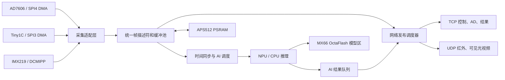

# STM32N6 多模态采集、AI 与以太网架构规划

日期：2026-07-10

适用工程：`variants/fsbl_appli_all`

当前开发分支：`codex/fsbl-appli-all-gigabit-throughput-20260709`

## 1. 规划目标

在 STM32N6 板卡上同时支持以下数据源，并保证各数据链路互不阻塞、互不覆盖：

- AD7606 八通道高速采集数据
- Tiny1C 红外图像和温度数据
- IMX219 可见光图像
- 板端多模态 AI 推理结果

最终需要实现：

1. 三路数据能够持续并行采集。
2. 采集过程不被 TCP/UDP 发送速度阻塞。
3. 网络拥塞时不破坏正在采集的数据。
4. AI 推理与网络发送读取稳定、完整的数据帧。
5. 合理利用外接 APS512XXN-OBR-BG PSRAM 和 MX66UW1G45GXDI00 OctaFlash。
6. 支持运行状态统计、异常恢复以及后续固件和模型升级。

## 2. 当前验证基线

### 2.1 已验证功能

- RTL8211F-CG 已建立 `1000M-FD` 链路。
- NetX Duo TCP、UDP 通信正常。
- AD7606 可以通过 SPI4 DMA 连续采集，并通过 TCP 获取完整帧。
- Tiny1C 可以通过 SPI3 读取图像和温度帧，并通过 TCP 获取完整帧。
- IMX219 已完成 I2C 探测、传感器配置、DCMIPP 配置和连续采集启动。
- DCMIPP 硬件帧计数能够增长，当前未报告 CSI/PIPE 错误。

### 2.2 以太网吞吐基线

当前较稳定的测试结果：

| 测试模式 | TCP | UDP |
|---|---:|---:|
| Pattern 填充 | 约 159～161 Mbps | 约 200 Mbps |
| No-fill | 约 218 Mbps | 约 275 Mbps |

UDP 测试中 PC 端接收率达到 100%，未观察到分片序号缺失。

Pattern 与 no-fill 的差距说明当前性能不仅受到以太网 DMA 限制，还受到 CPU 填充、内存复制和 Cache 操作影响。

### 2.3 当前主要限制

- 应用链接脚本只提供约 1536 KiB 内部 RAM。
- IMX219 当前使用一个 640×480 RGB565 帧缓冲，大小为 614400 字节。
- DCMIPP 连续写入单缓冲时，网络线程可能同时读取同一缓冲。
- 当前 `CAMGET` 通过临时停止采集来冻结图像，能够保证 CRC，但不适合最终持续流架构。
- XSPI1 PSRAM 尚未通过 ExtMem Manager 正式初始化。
- 三路数据目前仍缺少统一的缓冲所有权、时间戳和网络调度机制。

## 3. 数据带宽预算

### 3.1 原始数据带宽

| 数据源 | 参数 | 估算有效负载 |
|---|---|---:|
| IMX219 | 640×480、RGB565、24 fps | 约 118 Mbps |
| Tiny1C | 256×192、16 bit、25 fps | 约 19.7 Mbps |
| AD7606 | 约 8240 B/帧、约 50 帧/s | 约 3.3 Mbps |
| 合计 | 不含协议开销 | 约 141 Mbps |

加入以太网、IP、TCP/UDP、自定义分片头和调度间隙后，持续原始数据流会接近当前 Pattern 测试的稳定吞吐上限。

因此：

- 原始 RGB565 可见光适合作为调试模式。
- 生产模式建议使用硬件 VENC 编码可见光视频。
- AI 推理使用本地原始帧或 DCMIPP 下采样帧，不需要从网络数据反向解析。

## 4. 总体架构



系统划分为以下层次：

1. 驱动和中断层
2. 采集适配层
3. 统一缓冲与帧描述层
4. 时间同步和 AI 调度层
5. 网络发布层
6. 持久化存储和系统管理层

## 5. 采集与缓冲模型

### 5.1 统一帧描述符

建议所有数据源使用统一描述符：

```c
typedef enum
{
  APP_STREAM_AD7606,
  APP_STREAM_TINY1C_IMAGE,
  APP_STREAM_TINY1C_TEMP,
  APP_STREAM_IMX219,
  APP_STREAM_AI_RESULT
} AppStreamId;

typedef struct
{
  AppStreamId stream_id;
  uint32_t sequence;
  uint64_t timestamp_us;
  void *data;
  uint32_t length;
  uint32_t capacity;
  uint32_t format;
  uint32_t flags;
  uint32_t crc32;
  volatile uint32_t ref_count;
} AppFrameDescriptor;
```

### 5.2 缓冲状态

```text
FREE
  -> DMA_FILLING
  -> READY
  -> NET_USING / AI_USING
  -> FREE
```

基本规则：

- DMA 只能写入 `FREE` 缓冲。
- DMA 完成后才能发布 `READY` 描述符。
- 网络和 AI 只读取 `READY` 缓冲。
- 网络与 AI 可以通过引用计数共享同一帧。
- 引用计数归零后，缓冲才能重新交给 DMA。
- CRC 必须在帧完成且不再被 DMA 修改后计算。

### 5.3 队列满时的处理

| 数据类型 | 队列满策略 |
|---|---|
| 控制和 AI 结果 | 保留队列，不能被视频挤占 |
| AD7606 | 优先保留，记录溢出；必要时写入 PSRAM 环形缓存 |
| 红外 | 丢弃最旧完整帧，保留最新帧 |
| 可见光 | 丢弃最旧完整帧，禁止阻塞 DCMIPP |

任何网络拥塞都不能反向阻塞 DMA 中断或采集线程。

## 6. 外部 PSRAM 规划

APS512XXN-OBR-BG 按 512 Mbit 规划，总容量约 64 MiB，主要作为运行时数据存储。

初步建议：

| 区域 | 建议大小 | 用途 |
|---|---:|---|
| 可见光帧池 | 4 MiB | 6 个 640×480 RGB565 缓冲 |
| 红外帧池 | 1 MiB | 8 个 98304 字节缓冲 |
| AD7606 环形缓存 | 8～16 MiB | 保存连续采样时间窗 |
| AI 输入和工作区 | 24～32 MiB | 多模态输入、预处理和中间数据 |
| 网络 staging | 4～8 MiB | 分片、编码和待发送数据 |
| 系统预留 | 剩余空间 | 后续模型和分辨率扩展 |

PSRAM 分配建议使用静态分区加固定块池，不使用通用 `malloc()`。

### 6.1 PSRAM 接入前需要修正

当前工程存在以下配置问题：

- `XSPI1.MemorySize` 当前配置为 256 MB，应按实际 64 MiB 修正。
- XSPI1 RIF 区域当前为 `0x02000000`，只覆盖 32 MiB。
- 如需使用全部 64 MiB，应将可访问区域扩展到 `0x04000000`。
- `EXTMEM_DRIVER_PSRAM` 当前为 `0`。
- `MX_EXTMEM_Init()` 当前只初始化 XSPI2 上的外部 Flash。
- 当前中间件记录主要针对 APS256XXN，启用 APS512XXN 前需要核对寄存器、命令和时序兼容性。

PSRAM 上线前必须完成：

1. 器件 ID 或寄存器读取。
2. Memory-mapped 模式启用。
3. 地址线和数据线测试。
4. 首尾地址测试。
5. 全容量 March 或分块读写测试。
6. Cache 开启和关闭状态下的一致性测试。
7. CPU、HPDMA、DCMIPP 并发访问测试。

## 7. OctaFlash 规划

MX66UW1G45GXDI00 按 1 Gbit 规划，总容量约 128 MiB。

建议逻辑分区：

| 区域 | 用途 |
|---|---|
| 启动和恢复区 | FSBL、恢复信息 |
| 应用镜像 A/B | 固件升级和回滚 |
| AI 模型 A/B | 当前模型和待升级模型 |
| 标定区 | AD、红外、可见光标定参数 |
| 配置区 | 网络、采集和 AI 参数，双副本加 CRC |
| 日志区 | 崩溃信息、统计和低频事件日志 |

当前 AI 权重使用 `0x71000000`，后续规划 Flash 分区时必须保留或统一迁移该地址。

OctaFlash 不作为实时图像帧缓存。写 Flash 时需要考虑擦除延迟、寿命以及 Memory-mapped 读取和间接写入之间的互斥。

## 8. DMA 与总线分工

### 8.1 当前通道

| 外设 | DMA |
|---|---|
| Tiny1C SPI3 TX | GPDMA1 Channel 8 |
| Tiny1C SPI3 RX | GPDMA1 Channel 9 |
| AD7606 SPI4 TX | GPDMA1 Channel 10 |
| AD7606 SPI4 RX | GPDMA1 Channel 11 |
| IMX219 | DCMIPP 自身 AXI 写通道 |
| Ethernet | ETH 自身 DMA |

### 8.2 后续分工

- GPDMA 继续负责 SPI 外设数据搬运。
- DCMIPP 直接写入可见光多帧缓冲。
- ETH DMA 只负责网络描述符和 NetX packet。
- HPDMA 用于内部 SRAM、PSRAM、AI 输入和网络 staging 之间的内存搬运。

中断服务函数只完成：

1. 清中断标志。
2. 更新时间戳和计数。
3. 切换下一 DMA 缓冲。
4. 发布完成事件。

CRC、图像处理、数据格式转换和网络发送不得放在中断中。

## 9. Cache 一致性规则

所有 DMA 缓冲必须按 Cache line 对齐，并统一封装 Cache 操作。

基本规则：

- CPU 写、DMA 读：启动 DMA 前执行 Clean。
- DMA 写、CPU 读：DMA 完成后执行 Invalidate。
- DMA 正在写入时，CPU 不得访问该缓冲。
- 禁止在 DMA 写完后对目标区域执行可能覆盖新数据的错误 Clean 操作。
- ETH 描述符、NetX packet pool 和控制结构优先保留在内部 SRAM。

建议提供统一接口：

```c
AppCache_PrepareForDmaRead(address, length);
AppCache_PrepareForDmaWrite(address, length);
AppCache_CompleteDmaWrite(address, length);
```

## 10. 网络通道与调度

### 10.1 建议通道

| 通道 | 协议 | 建议用途 |
|---|---|---|
| TCP 5000 | TCP | 控制命令、状态查询 |
| AD 数据端口 | 独立 TCP | AD7606 可靠连续传输 |
| 红外数据端口 | TCP 或 UDP | 红外图像和温度帧 |
| 可见光数据端口 | UDP | H.264 或分片图像 |
| AI 结果端口 | TCP | 检测结果、告警和元数据 |

多个 socket 仍然共享 NetX IP 线程、packet pool 和 ETH DMA，因此不能让各采集线程直接竞争网络资源。

### 10.2 统一网络发布器

建议只由网络发布线程执行 NetX 发送，其他模块只提交描述符。

调度优先级：

```text
控制命令和 AI 结果
  > AD7606
  > 红外
  > 可见光视频
```

可采用带权轮询和 Token Bucket：

- 控制和 AI 结果始终保留带宽。
- AD7606 分配固定最低带宽。
- 红外分配固定带宽。
- 可见光使用剩余带宽并进行 pacing。

### 10.3 NetX 资源隔离

建议建立：

- 小包池：ARP、ICMP、TCP ACK、控制命令和 AI 结果。
- MTU 数据包池：AD、红外和视频数据。

视频不能耗尽小包池，否则可能造成设备仍在运行但 Ping、TCP ACK 和控制命令全部超时。

### 10.4 数据分片头

每个 UDP 分片至少包含：

```text
magic
protocol_version
stream_id
frame_sequence
timestamp
frame_length
fragment_index
fragment_count
payload_length
frame_crc32
```

PC 端根据帧号和分片号重组，并统计丢帧、乱序和超时。

## 11. 可见光传输建议

调试阶段：

- 保留 `CAMGET` 单帧 TCP 抓取。
- 支持低帧率 RGB565 UDP 连续流。

生产阶段：

- DCMIPP 输出完整图像供本地处理。
- 使用 VENC 对可见光进行硬件 H.264 编码。
- 网络只发送编码码流。
- DCMIPP 额外生成下采样图像供 AI 使用。

这样可以将网络负载和 CPU 内存复制显著降低，同时保留本地 AI 所需图像质量。

## 12. 多模态 AI 调度

### 12.1 统一时间基准

三路数据统一使用 64 位单调递增微秒时间戳：

- IMX219：优先记录 SOF 时间。
- Tiny1C：记录帧开始或帧完成时间。
- AD7606：记录数据块起始和结束采样时间。

不能使用 TCP/UDP 到达 PC 的时间作为采集时间。

### 12.2 数据对齐

以可见光或红外帧时间 `T` 为基准：

1. 选择时间最接近 `T` 的另一种图像。
2. 选择覆盖 `T` 前后指定时间窗的 AD7606 数据。
3. 形成一个多模态推理任务。
4. 增加三个输入描述符的引用计数。
5. 推理结束后释放引用。

### 12.3 推理频率

采集频率和推理频率分离：

- 可见光保持 24 fps 采集。
- 红外按传感器输出频率采集。
- AD7606 持续采集。
- AI 初期按 5～10 fps 运行。
- AI 负载过高时跳过旧任务，只处理最新完整数据组合。

AI 不能阻止采集线程继续工作。

## 13. 线程和任务建议

建议线程划分：

| 线程 | 职责 |
|---|---|
| Sensor Supervisor | 初始化、启动、停止和故障恢复 |
| AD Capture | AD7606 DMA 完成处理和入队 |
| IR Capture | Tiny1C 帧读取和入队 |
| Camera Capture | DCMIPP 帧切换和入队 |
| AI Scheduler | 三模态时间对齐和任务创建 |
| AI Worker | 预处理和 NPU 推理 |
| Network Publisher | TCP/UDP 分片、调度和发送 |
| Storage Worker | 配置、标定、模型和日志操作 |
| Telemetry | 统计、健康检查和看门狗 |

NetX IP 线程和采集相关中断必须保持较高响应优先级。存储和日志线程保持最低优先级。

## 14. 运行统计

每一路至少记录：

- DMA 完成次数
- 完整帧数
- CRC 错误
- DMA 错误
- 队列峰值
- 缓冲池最低剩余量
- 主动丢帧数
- 网络发送成功和失败次数
- 平均和最大排队延迟
- Cache 操作次数
- AI 推理次数、跳过次数和耗时

建议扩展现有 `STAT` 命令，以便持续检查资源是否被某一路耗尽。

## 15. 分阶段实施计划

### 阶段 1：PSRAM 初始化与测试

- 修正 XSPI1 容量和 RIF 范围。
- 增加 APS512 初始化。
- 启用 Memory-mapped 模式。
- 增加 `PSRAMTEST` 和 `PSRAMSTAT` 命令。
- 完成 CPU、Cache 和 DMA 读写测试。

验收条件：

- 全容量测试无地址镜像和数据错误。
- 连续运行时无 HardFault、RIF 或 XSPI 错误。

### 阶段 2：统一帧池

- 实现 `AppFrameDescriptor`。
- 实现固定块缓冲池、引用计数和状态机。
- 建立三路独立 READY 队列。

验收条件：

- 不存在 DMA 写入和网络读取同一缓冲的情况。
- 队列满时按策略丢帧，不阻塞采集。

### 阶段 3：IMX219 多缓冲

- 将可见光缓冲迁移到 PSRAM。
- 建立三缓冲或六缓冲环形池。
- DCMIPP 帧完成后自动切换下一缓冲。
- 移除正常抓帧流程中的停止传感器操作。

验收条件：

- 摄像头持续运行时 `CAMGET` CRC 始终正确。
- 抓图期间硬件帧计数持续增长。

### 阶段 4：红外与 AD 并行稳定性

- Tiny1C 使用独立缓冲池。
- AD7606 使用独立环形缓存。
- 清理共享临界区和共享临时缓冲。
- 验证 SPI3、SPI4、DCMIPP 和 ETH 并行工作。

验收条件：

- 红外无黑点、错行、撕裂和端序异常。
- AD7606 无序号间断、CRC 错误和 DMA 错误。

### 阶段 5：统一网络发布器

- 建立多优先级发送队列。
- 分离控制小包池和媒体数据包池。
- 增加 UDP 分片协议和 pacing。
- 增加每路带宽、队列和丢帧统计。

验收条件：

- 视频满负载时 Ping 和控制 TCP 仍稳定。
- AD 和 AI 结果不会被视频发送饿死。

### 阶段 6：AI 管线

- 实现统一时间戳。
- 实现多模态对齐。
- 将 AI 输入和工作区迁移到规划内存。
- 建立推理结果上传协议。

验收条件：

- 推理运行时三路采集无明显丢帧增加。
- 推理结果携带对应输入帧号和时间戳。

### 阶段 7：可见光编码和长期压力测试

- 接入 VENC H.264。
- 可见光编码流通过 UDP 发送。
- 进行多路数据、AI、网络和存储并发测试。

验收条件：

- 持续运行至少 8～24 小时。
- 无内存泄漏、缓冲泄漏、死锁或网络失联。
- 所有丢帧和恢复行为均可通过统计信息解释。

## 16. 推荐的下一步

下一步先不同时改动三路采集和网络协议，优先完成：

1. XSPI1 PSRAM 初始化。
2. PSRAM 容量、Cache 和 DMA 测试。
3. 将 IMX219 从内部单缓冲迁移为 PSRAM 多缓冲。

完成这三项后，可见光持续采集将不再依赖 `CAMGET` 时暂停 DCMIPP，也会为红外、AD7606 和 AI 的统一缓冲架构建立基础。
