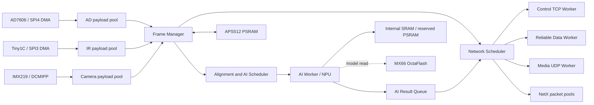

# STM32N6 多模态采集、AI 与以太网架构规划（修订版）

日期：2026-07-13
适用工程：`variants/fsbl_appli_all`
当前开发分支：`codex/fsbl-appli-all-gigabit-throughput-20260709`

本文件描述目标架构和实施约束。文档中的外部存储地址属于初步规划，必须在阶段 0 完成器件、RIF、Cache、链路和启动流程验证后才能固化。

## 1. 规划目标

系统需要同时处理以下数据源：

- AD7606 八通道连续采样数据；
- Tiny1C 红外图像和温度数据；
- IMX219 可见光图像；
- 板端 AI 推理输入和结果。

架构必须满足：

1. 采集链路不因网络发送速度变慢而停止。
2. 网络拥塞不能覆盖 DMA 正在写入或 AI 正在读取的数据。
3. 每类数据都具有独立的缓冲、队列、丢弃策略和运行统计。
4. AI 只能获取已经完成且具有明确时间范围的数据组合。
5. 控制命令、状态和 AI 结果不能被视频或历史数据传输饿死。
6. APS512 PSRAM 用于运行时数据，MX66 OctaFlash 用于固件、模型、配置和日志。
7. 系统能够报告资源不足、数据丢失、DMA 错误和恢复过程。

## 2. 当前验证基线

### 2.1 已验证功能

- RTL8211F-CG 已建立 `1000M-FD` 链路。
- NetX Duo TCP、UDP 通信正常。
- AD7606 可通过 SPI4 DMA 连续采集并获取完整帧。
- Tiny1C 可通过 SPI3 DMA 读取图像和温度帧。
- IMX219 已完成传感器探测、配置、DCMIPP 初始化和连续采集。
- 摄像头运行时 DCMIPP 帧计数可以持续增长，当前未观察到 CSI/PIPE 错误。

### 2.2 以太网基线

历史 no-fill 测试峰值约为 TCP `218 Mbps`、UDP `275 Mbps`。当前优先级调整后的稳定结果为：

| 场景 | TCP | UDP | 说明 |
|---|---:|---:|---|
| 摄像头未启动，no-fill | 约 `203.7 Mbps` | 约 `253.1 Mbps` | AD7606 后台运行 |
| 摄像头连续运行，no-fill | 约 `203.7 Mbps` | 约 `252.6 Mbps` | 约 24 fps，未见明显降速 |
| Pattern 填充历史结果 | 约 `159～161 Mbps` | 约 `200 Mbps` | 仅用于 CPU/Cache 压力参考 |

上述结果是吞吐测试，不等同于生产多路原始数据流的长期保证值。生产预算应按当前稳定值和必要的控制带宽计算，并保留突发余量。

### 2.3 当前资源状态

- 应用链接脚本提供约 `1536 KiB` 内部 RAM。
- 当前应用构建结果约为 `text=134316`、`data=244`、`bss=885108`。
- 当前 IMX219 单帧 RGB565 缓冲为 `640×480×2 = 614400` 字节。
- 当前 ThreadX 应用内存池为 `16 KiB`，不能直接容纳规划中的多线程栈和队列。
- 当前 NetX 使用约 40 个 `1536` 字节数据包的统一数据包池。
- 当前 XSPI1 PSRAM 尚未作为运行时数据区正式启用。
- 当前 AI 生成配置使用 `0x71000000` 的 XSPI2 区域存放权重，并把 `0x90000000` 视为 xSPI1 内存池起点。

## 3. 架构原则

### 3.1 统一接口，不统一所有 payload

所有数据源使用统一的帧描述符、时间戳和队列接口，但 payload 缓冲按数据源独立分配：

- AD7606 使用连续样本块和环形块池；
- Tiny1C 使用固定大小的图像/温度帧池；
- IMX219 使用大帧多缓冲池；
- AI 结果使用小对象池；
- 网络数据包使用 NetX packet pool。

不能把 8 KiB、98 KiB 和 614 KiB 数据强行放入同一种固定块池。

### 3.2 采集所有权优先于传输所有权

DMA 完成后，采集模块先取得已完成缓冲的所有权，再向下游发布描述符。网络和 AI 只能租用已经发布的缓冲，不能直接访问 DMA 当前使用的地址。

### 3.3 采集、调度和发送分离

采集事件只更新计数、切换缓冲并投递事件。时间对齐、CRC、格式转换、分片和网络发送都在任务上下文中完成。

### 3.4 NVIC 优先级和 ThreadX 优先级分开管理

两者使用不同的调度机制，必须分别记录。当前已经验证的 NVIC 关系为：

```text
ETH1       priority 7
AD/SPI4    priority 8
DCMIPP/CSI priority 10
```

ThreadX 线程则按 NetX IP、控制、采集、AI、存储的职责单独规划，不能用同一张表混写。

## 4. 数据与资源预算

### 4.1 以太网有效负载预算

| 数据源 | 参数 | 原始有效负载 |
|---|---|---:|
| IMX219 | 640×480、RGB565、24 fps | 约 `118 Mbps` |
| Tiny1C | 256×192、16 bit、25 fps | 约 `19.7 Mbps` |
| AD7606 | 8240 B/帧、约 50 帧/s | 约 `3.3 Mbps` |
| 合计 | 不含协议和重传 | 约 `141 Mbps` |

`141 Mbps` 只表示数据量，不表示系统一定能以该速率稳定发送。还需要考虑：

- Ethernet、IP、TCP/UDP 和自定义分片开销；
- TCP ACK 和控制命令；
- NetX packet 分配与释放；
- Cache Clean/Invalidate；
- payload 从 PSRAM 读取到 ETH DMA；
- AI 读取和 HPDMA 搬运；
- 拥塞时的队列延迟和重传。

调试阶段可以发送低帧率 RGB565。生产阶段应优先使用 VENC 输出的编码码流，原始可见光帧只保留给本地 AI 或按需抓取。

### 4.2 内存访问预算

以原始数据计算：

- 可见光 DCMIPP 写入约 `14.1 MiB/s`；
- Tiny1C 约 `2.35 MiB/s`；
- AD7606 约 `0.39 MiB/s`；
- 网络再读取一次完整 payload 时，至少增加约 `16.8 MiB/s`；
- 对可见光每帧再做一次完整软件 CRC，还会增加约 `14.1 MiB/s` 的读取。

因此必须分别测量：

1. 传感器到目标存储区的写带宽；
2. CPU/HPDMA/NPU 对目标存储区的读写带宽；
3. ETH DMA 从目标存储区读取 payload 的带宽；
4. 多主机并发访问时的最坏延迟。

生产模式不应对 24 fps 原始 RGB565 每帧重复执行高开销的软件 CRC。应根据可靠性要求选择硬件 CRC、增量 CRC、分片 CRC 或低频抽检。

## 5. 总体架构



网络调度器只负责选择待发送描述符、限速和投递到对应 worker，不在调度器中执行可能无限等待的 socket 发送。

## 6. 帧描述符和缓冲所有权

### 6.1 描述符

建议使用如下字段，实际类型可根据 ABI 调整：

```c
typedef struct
{
  uint16_t stream_id;
  uint16_t format;
  uint32_t sequence;
  uint32_t generation;
  uint32_t flags;

  uintptr_t data;
  uint32_t length;
  uint32_t capacity;

  uint64_t capture_start_us;
  uint64_t capture_end_us;
  uint64_t publish_us;

  uint32_t crc32;
  uint32_t consumer_mask;
  uint16_t lease_count;
  uint16_t state;
} AppFrameDescriptor;
```

`ref_count` 不能只声明为 `volatile`。描述符的状态、租约计数和消费者位图必须通过 Frame Manager API 修改，并在任务和中断之间使用临界区或原子操作保护。

### 6.2 状态机

```text
FREE
  -> DMA_OWNED
  -> READY
  -> LEASED
  -> RETIRING
  -> FREE

DMA_ERROR / INVALID
  -> ERROR
  -> FREE
```

`READY` 表示帧已完成但尚未被消费者租用。网络和 AI 可以同时租用同一帧；所有租约释放后才进入 `RETIRING`。`generation` 用于防止旧描述符在缓冲重新分配后误释放。

建议提供以下接口：

```c
AppFrame_AcquireForDma(stream_id, &descriptor);
AppFrame_PublishReady(descriptor);
AppFrame_Lease(descriptor, consumer_id);
AppFrame_Release(descriptor, consumer_id);
AppFrame_GetStats(stream_id, &stats);
```

### 6.3 队列满处理

| 数据类型 | 队列满策略 |
|---|---|
| 控制命令 | 保留队列，发送失败时返回错误 |
| AI 结果 | 保留最新结果和告警结果，不能被视频挤占 |
| AD7606 | 记录溢出和缺口；是否丢弃由工作模式决定 |
| Tiny1C | 丢弃旧帧，保留最新完整帧 |
| IMX219 | 丢弃旧帧，禁止阻塞 DCMIPP |

当没有可用的摄像头 payload 缓冲时，DCMIPP 必须切换到专用丢帧缓冲或受控的 sink，不得复用仍被网络或 AI 租用的地址。

## 7. 时间基准和多模态对齐

### 7.1 时间基准

使用一个可读取到微秒级的硬件计时器作为单调时钟，并在软件中扩展为 64 位：

- 中断中记录硬件计时器值；
- 任务中完成 32 位计时器回绕扩展；
- 64 位值读取时使用临界区或序列锁，避免撕裂；
- 不使用 PC 收到 TCP/UDP 数据的时间作为采集时间。

### 7.2 时间字段

- IMX219：记录 SOF；若能获得曝光中心时间，则同时记录曝光区间；
- Tiny1C：记录 SPI 帧开始和结束；
- AD7606：记录样本块起始、结束采样计数和对应时间；
- 网络：单独记录发布时间，不覆盖采集时间。

### 7.3 对齐规则

以可见光或红外帧的目标时间 `T` 为基准：

1. 选择另一路图像中时间范围与 `T` 最近的完整帧；
2. 选择覆盖 `T` 的 AD7606 样本窗口；
3. 检查最大允许时间偏差；
4. 生成带三个输入 `sequence` 和时间范围的 AI 任务；
5. 为输入帧增加租约，推理完成后统一释放。

最大时间偏差、AD 窗口长度和图像匹配策略必须成为可配置参数，并在 AI 结果中回传。

## 8. APS512 PSRAM 规划

APS512XXN-OBR-BG 按 `512 Mbit = 64 MiB` 规划。XSPI1 的可访问范围应最终覆盖：

```text
0x90000000 .. 0x93FFFFFF
```

以下是第一版运行时分区，先使用低地址的 32 MiB，剩余空间作为预留：

| 地址范围 | 大小 | 用途 |
|---|---:|---|
| `0x90000000..0x903FFFFF` | 4 MiB | IMX219 多帧池 |
| `0x90400000..0x904FFFFF` | 1 MiB | Tiny1C 图像/温度帧池 |
| `0x90500000..0x90CFFFFF` | 8 MiB | AD7606 环形缓存 |
| `0x90D00000..0x91CFFFFF` | 16 MiB | AI 输入、预处理和工作区 |
| `0x91D00000..0x91EFFFFF` | 2 MiB | 网络 staging 和分片缓存 |
| `0x91F00000..0x91FFFFFF` | 1 MiB | 诊断、保护和测试区 |
| `0x92000000..0x93FFFFFF` | 32 MiB | 后续模型、分辨率和历史缓存预留 |

这是逻辑分区，不是最终链接地址。必须满足：

- AI 生成的 xSPI1 memory pool 起点不能继续无条件使用 `0x90000000`；
- 分区首尾按 Cache line、DMA 对齐和实际器件访问要求对齐；
- 每个分区保留越界保护区和运行时水印；
- RIF、MPU/SAU 和 Cache 属性必须与实际读写方向一致；
- 只有通过容量、边界、March/分块读写和并发测试后，才能启用全部 64 MiB。

当前工程还需要修正：

- XSPI1 `MemorySize` 不能继续按 256 MB 配置；
- XSPI1 RIF 当前只覆盖约 32 MiB，扩展到全容量前需完成访问测试；
- `EXTMEM_DRIVER_PSRAM` 当前为关闭状态；
- `MX_EXTMEM_Init()` 当前主要初始化 XSPI2，PSRAM 需要独立初始化和测试流程。

PSRAM 不使用通用 `malloc()`。采用静态分区、固定块池和显式所有权。

## 9. MX66UW1G45GXDI00 OctaFlash 规划

MX66UW1G45GXDI00 按 `1 Gbit = 128 MiB` 规划。XSPI2 逻辑地址范围为：

```text
0x70000000 .. 0x77FFFFFF
```

以下为暂定逻辑分区，最终边界必须按 SFDP 返回的擦除块大小调整：

| 地址范围 | 大小 | 用途 |
|---|---:|---|
| `0x70000000..0x700FFFFF` | 1 MiB | 启动元数据、恢复状态和签名 |
| `0x70100000..0x707FFFFF` | 7 MiB | 应用镜像 A |
| `0x70800000..0x70EFFFFF` | 7 MiB | 应用镜像 B |
| `0x70F00000..0x70FFFFFF` | 1 MiB | 配置、标定和低频日志 |
| `0x71000000..0x73FFFFFF` | 48 MiB | AI 模型 A |
| `0x74000000..0x76FFFFFF` | 48 MiB | AI 模型 B |
| `0x77000000..0x77FFFFFF` | 16 MiB | 预留、崩溃日志和扩展 |

当前应用运行流程已经使用 `0x70100000` 附近的外部加载区域，AI 权重使用 `0x71000000`。在引入 A/B 更新前不得随意改变这两个入口。

模型和固件更新必须包含：

- 版本号、长度、目标分区和 CRC；
- 签名或至少可验证的完整性元数据；
- 下载完成后的独立校验；
- 双副本元数据；
- 断电恢复和回滚状态；
- 防止运行时同时进行 Memory-mapped 读取和间接写入。

当前 `.ioc` 中 XSPI2 容量配置为 `1GB`，与实际 128 MiB 器件不符，必须在存储阶段修正。

## 10. DMA、DCMIPP 和 Cache

### 10.1 当前 DMA 分工

| 外设 | DMA/通道 |
|---|---|
| Tiny1C SPI3 TX | GPDMA1 Channel 8 |
| Tiny1C SPI3 RX | GPDMA1 Channel 9 |
| AD7606 SPI4 TX | GPDMA1 Channel 10 |
| AD7606 SPI4 RX | GPDMA1 Channel 11 |
| IMX219 | DCMIPP 自身 AXI 写通道 |
| Ethernet | ETH 自身 DMA |

### 10.2 摄像头多缓冲

DCMIPP 硬件原生提供双缓冲地址。软件环形池可以使用 4～6 个 PSRAM payload，但必须按以下方式实现：

1. 两个地址由 DCMIPP 硬件轮换；
2. 帧完成回调识别刚完成的 bank；
3. 采集管理器从软件池取得下一个 `FREE` 缓冲；
4. 在非活动 bank 上更新下一帧地址；
5. 没有空闲缓冲时使用专用丢帧缓冲并计数。

在直接写 PSRAM 通过验证前，不允许假设 DCMIPP、CPU、ETH 和 HPDMA 可以任意并发访问。需要分别测试：

- DCMIPP 直接写 PSRAM；
- CPU 读取已完成帧；
- ETH DMA 读取待发送帧；
- HPDMA 在两个方向搬运；
- NPU 与 PSRAM 并发访问。

如果直接写 PSRAM 的带宽或稳定性不足，备用方案应是降低原始分辨率/格式、使用更小的内部双缓冲，或把采集结果按行/块搬运到 PSRAM；不能在内部 RAM 不足时假设可以同时放置两个完整 RGB565 帧。

### 10.3 Cache 规则

所有 DMA payload 和描述符按实际 Cache line 对齐，区间首尾按 Cache line 向外取整。建议提供：

```c
AppCache_PrepareForDmaRead(address, length);
AppCache_PrepareForDmaWrite(address, length);
AppCache_CompleteDmaWrite(address, length);
```

接口内部必须包含必要的 Clean、Invalidate、`DMB/DSB` 和所有权检查。DMA 写入期间，CPU、网络和 AI 不得读取同一 payload。

描述符、队列控制块、ETH 描述符和 NetX 控制结构优先放内部 SRAM；大 payload 放 PSRAM。

## 11. 网络通道与发送调度

### 11.1 通道

| 通道 | 协议 | 用途 |
|---|---|---|
| TCP 5000 | TCP | 控制命令和状态 |
| AD 数据 | TCP 或受控 UDP | AD7606 数据 |
| 红外数据 | TCP/UDP | Tiny1C 图像和温度 |
| 可见光媒体 | UDP | 编码视频或分片图像 |
| AI 结果 | TCP 或控制 TCP | 检测结果、告警和元数据 |

端口号和数据格式应由协议版本统一管理，不能让每个采集模块自行创建无限等待的 socket。

### 11.2 发送线程模型

建议拆分为：

1. `Network Scheduler`：选择描述符、执行优先级和带宽预算；
2. `Control TCP Worker`：命令、状态和小结果；
3. `Reliable Data Worker`：AD 或其他需要可靠传输的数据；
4. `Media UDP Worker`：红外、可见光或编码媒体；
5. `AI Result Worker`：低延迟结果和告警。

网络 worker 使用有限发送等待时间和有界队列。慢速 TCP 客户端只能阻塞对应 worker，不能阻塞控制和其他媒体通道。

调度顺序为：

```text
控制命令/告警
  > AI 结果
  > AD 可靠数据
  > 红外数据
  > 可见光媒体
```

AD 需要区分两种工作模式：

- `LIVE`：允许丢弃旧块，但必须记录序号缺口；
- `LOSSLESS_WINDOW`：使用 PSRAM 环形缓存保存有限时间窗，溢出时明确报警。

8 MiB AD 缓存约只能保存几十秒的数据，不能被描述为无限可靠缓存。

### 11.3 NetX packet 资源

NetX 的主 packet pool、辅助 packet pool 和应用 payload pool 不是同一概念。不能只声明“小包池”和“大包池”就自动获得资源隔离。实现时必须：

- 为控制和 ACK 预留最低 packet 数；
- 为媒体发送设置最大并发 packet 数；
- 为每个 worker 设置队列上限；
- 记录 packet pool 低水位和等待时间；
- 验证 `nx_ip_auxiliary_packet_pool_set()` 等接口是否覆盖目标路径；
- 在资源耗尽时丢弃媒体帧，而不是阻塞控制。

### 11.4 UDP 分片头

每个 UDP 分片至少包含：

```text
magic
protocol_version
header_length
boot_session_id
stream_id
format
flags
frame_sequence
timestamp_start
timestamp_end
frame_length
fragment_index
fragment_count
payload_length
frame_crc32
fragment_crc32
```

`boot_session_id` 用于避免设备重启后序号复用。`format`、端序和压缩方式必须进入协议头，不能由接收端猜测。

## 12. AI 管线

### 12.1 模型契约

每个模型版本必须附带以下信息：

- 模型 ID、版本和校验值；
- 输入模态、尺寸、布局和端序；
- 量化参数；
- 输入和输出缓冲大小；
- activation 峰值和工作区；
- 权重所在 Flash 分区；
- 所需 PSRAM 区域；
- 最大推理时间和目标帧率；
- 允许的多模态最大时间偏差。

当前生成的 `tiny_temporal_mixer_8ch_int8` 是单输入、约 `8192` 字节输入和 `4` 字节输出的模型，不能直接代表未来多模态模型的内存需求。未来模型切换时，必须重新生成 AI memory profile，并同步更新 PSRAM 分区表。

### 12.2 调度

- 采集频率和推理频率分离；
- AI 初期按 5～10 fps 运行；
- 推理过载时丢弃旧任务，只处理最新完整组合；
- AI 不得等待网络发送完成；
- AI 结果携带输入帧的 `stream_id`、`sequence`、时间范围和模型版本。

## 13. 线程与内存预算

建议线程按职责划分，实际优先级在实现阶段结合栈水位验证：

| 线程/模块 | 职责 | 阻塞约束 |
|---|---|---|
| Sensor Supervisor | 初始化、停止和恢复 | 不参与数据发送 |
| AD Capture | DMA 完成和块入队 | 不等待网络 |
| IR Capture | Tiny1C 读帧和入队 | 不等待视频队列 |
| Camera Capture | DCMIPP bank 管理 | 不等待 AI/网络 |
| AI Scheduler | 时间对齐和任务生成 | 不直接操作 socket |
| AI Worker | 预处理和 NPU 推理 | 不阻塞采集 |
| Control TCP | 命令和状态 | 小包、有限等待 |
| Reliable Data | AD 等可靠数据 | 只阻塞自身 |
| Media UDP | 视频和红外媒体 | 队列满时丢旧帧 |
| Storage Worker | 配置、模型和日志 | 最低优先级 |
| Telemetry | 统计和看门狗 | 不访问 DMA payload |

初步栈预算应至少按 `64 KiB` ThreadX 应用池评估，并结合 `tx_thread_stack_analyze()` 或等效水位统计收敛。当前 `16 KiB` 配置只能作为最小验证阶段配置。

## 14. 运行统计、恢复和安全

每一路至少记录：

- DMA 完成、半传输和错误次数；
- 完整帧数、序号缺口和 CRC 错误；
- 队列深度峰值和缓冲池最低余量；
- 主动丢帧数和丢帧原因；
- 网络发送成功、失败、重试和等待时间；
- Cache 操作次数；
- AI 推理次数、跳过次数和耗时；
- 外部存储访问错误；
- 最近一次恢复阶段和错误码。

建议扩展现有 `STAT`，并增加按模块查询的命令。恢复策略按设备划分：

- SPI DMA 错误：停止当前事务、清标志、重新配置 DMA；
- DCMIPP 错误：冻结当前帧、切换到安全缓冲、重新启动 pipe；
- NetX 链路错误：保留采集状态，重建 socket；
- PSRAM/Flash 错误：停止写入并报告存储故障；
- 看门狗复位：保存最小崩溃信息和启动原因。

固件和模型升级至少需要完整性校验、版本检查、断电恢复和回滚。量产环境还应增加签名验证和防回滚策略。

## 15. 分阶段实施计划

### 阶段 0：冻结资源和接口

- 修订 XSPI1/XSPI2 容量、RIF 和基地址；
- 固化 PSRAM/OctaFlash 逻辑地址表；
- 明确 AI 模型契约和当前模型占用；
- 明确 ThreadX、NetX、队列和栈预算；
- 定义帧描述符、状态机、时间戳和网络头。

验收条件：

- 所有地址区间无重叠；
- AI 生成配置与地址表一致；
- 线程和 packet 资源有静态预算；
- 采集、网络和 AI 的丢弃策略已明确。

### 阶段 1：PSRAM 和 OctaFlash 基础测试

- 修正 XSPI1/XSPI2 器件容量；
- 完成 PSRAM 初始化和 Memory-mapped 访问；
- 增加 `PSRAMTEST`、`PSRAMSTAT`；
- 完成首尾地址、分块、Cache、CPU/HPDMA 并发测试；
- 完成 Flash SFDP、擦除、读写和掉电恢复测试。

### 阶段 2：Frame Manager 和时间基准

- 实现描述符、per-stream payload pool、租约和状态机；
- 建立统一微秒计时基准；
- 将 AD7606、Tiny1C 和 IMX219 接入独立 READY 队列；
- 增加队列水位、丢帧和所有权错误统计。

### 阶段 3：IMX219 多缓冲

- 先验证 DCMIPP 双缓冲直接写 PSRAM；
- 实现软件 4～6 缓冲池；
- 帧完成后更新非活动 bank；
- 没有空闲缓冲时使用专用丢帧缓冲；
- 移除正常抓帧流程中停止传感器的操作。

验收条件：

- 摄像头连续运行时帧计数持续增长；
- `CAMGET` 不需要停止采集；
- 抓取期间 CRC 正确；
- 队列拥塞时不覆盖正在使用的帧。

### 阶段 4：AD7606 和 Tiny1C 并行稳定性

- 将两路 payload 纳入独立缓冲池；
- 保留 AD 环形缓存和序号缺口记录；
- 验证 SPI3、SPI4、DCMIPP、ETH 并行工作；
- 对 Tiny1C 增加帧有效性检查和失败重试接口，但不让重试阻塞 AD 采集。

### 阶段 5：网络发布器

- 实现调度器、控制 worker、可靠数据 worker 和媒体 worker；
- 设置每类队列上限、保留 packet 数和带宽预算；
- 增加 UDP 分片、重组、超时和丢帧统计；
- 在媒体满负载时验证 Ping、控制 TCP 和 AI 结果仍可用。

### 阶段 6：AI 管线

- 按模型契约分配输入和工作区；
- 实现时间对齐、租约和过载丢旧任务；
- 结果携带输入序号、时间范围和模型版本；
- 测量推理对采集、网络和内存总线的影响。

### 阶段 7：编码、升级和长期压力测试

- 接入 VENC H.264；
- 发送编码媒体流；
- 完成固件/模型 A/B 更新和回滚；
- 进行多路采集、AI、网络、存储和看门狗并发测试。

验收条件：

- 持续运行至少 8～24 小时；
- 无内存泄漏、缓冲泄漏、死锁或网络失联；
- 所有丢帧和恢复行为都能通过统计信息解释。

## 16. 当前推荐的下一步

不立即同时改动三路采集和网络协议。建议按以下顺序推进：

1. 先修正并验证 XSPI1/XSPI2 容量、RIF 和外部存储访问；
2. 固化阶段 0 的地址表和 AI memory profile；
3. 实现 Frame Manager、per-stream payload pool 和统一时间基准；
4. 再把 IMX219 从内部单缓冲迁移到 PSRAM 双缓冲/软件多缓冲；
5. 最后接入多 worker 网络发布器和 AI 调度。

这样可以先解决地址重叠、缓冲所有权和阻塞模型三个基础问题，再扩展数据流和推理功能。
