# 7月7日工作汇报：以太网 PoE AD7606 采集与 STM32N6 工程合并

汇报日期：2026 年 7 月 7 日  
汇报主题：带以太网 PoE 接口的 AD7606 采集系统设计、协议部署与 STM32N6 多工程合并进展

## 一、工作概述

近期工作主要围绕“带以太网 PoE 接口的 AD7606 数据采集系统”、STM32N6 多版本板卡设计生产，以及 STM32N6 端多功能工程合并展开。当前已经完成了以太网 PoE 接口 AD7606 采集硬件的设计与生产，同时完成了两版 STM32N6 板卡的生产：一版面向智能传感器方向，集成 PoE 以太网、红外摄像头、可见光摄像头和 AD7606 接口；另一版面向纯 AI 推理方向，仅保留 PoE 以太网接口，用于部署和验证边缘 AI 推理功能。

在软件侧，已经完成 STM32N6 端以太网 TCP/UDP 通信、AD7606 数据接收，以及二者之间的联动验证。同时，红外摄像头功能已经实现，可见光摄像头功能也完成了进一步优化，为后续多传感器统一工程合并打下基础。

目前合并工程 `fsbl_appli_all` 已经具备以下能力：

- 以太网接口正常启动，支持静态 IP 通信。
- UDP echo 服务部署完成，可用于网络链路测试。
- TCP command 服务部署完成，可用于上位机发送控制命令。
- AD7606 采集卡通过 SPI4 + GPDMA + EXTI 接入 STM32N6。
- AD7606 原始波形数据包接收、CRC 校验、包序号连续性检测均已跑通。
- TCP 命令可触发 AD7606 原始数据包解析，并通过串口输出采样数据，实现以太网控制与采集链路联动。
- 红外摄像头功能已经完成独立实现。
- 可见光摄像头功能已经完成进一步优化。

## 二、硬件设计与生产进展

已完成带以太网 PoE 接口的 AD7606 采集卡设计和生产，同时完成了两版 STM32N6 板卡的生产。

当前硬件工作包括三部分：

| 硬件版本 | 定位 | 主要接口与功能 |
| --- | --- | --- |
| PoE AD7606 采集卡（12*7） | 多通道模拟量采集 | PoE 以太网接口、AD7606 多通道采集|
| STM32N6 智能传感器板（11.3*10） | 多传感器采集与边缘 AI 分析 | PoE 以太网、红外摄像头、可见光摄像头、AD7606 接口 |
| STM32N6 AI 推理板（10.3*6.8） | 轻量化 AI 推理 | PoE 以太网接口，主要用于 AI 模型部署、推理 |


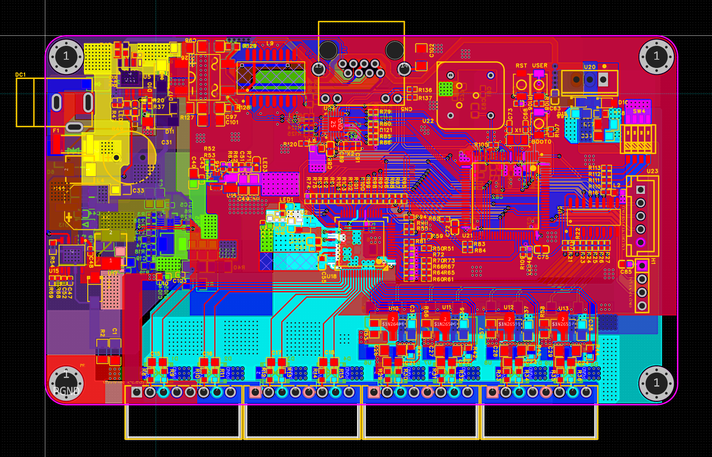
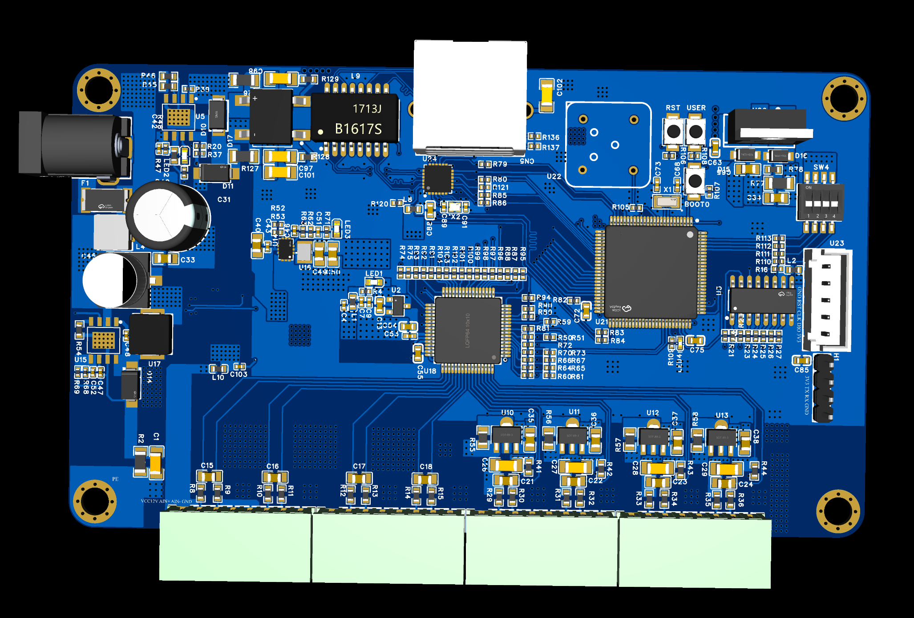

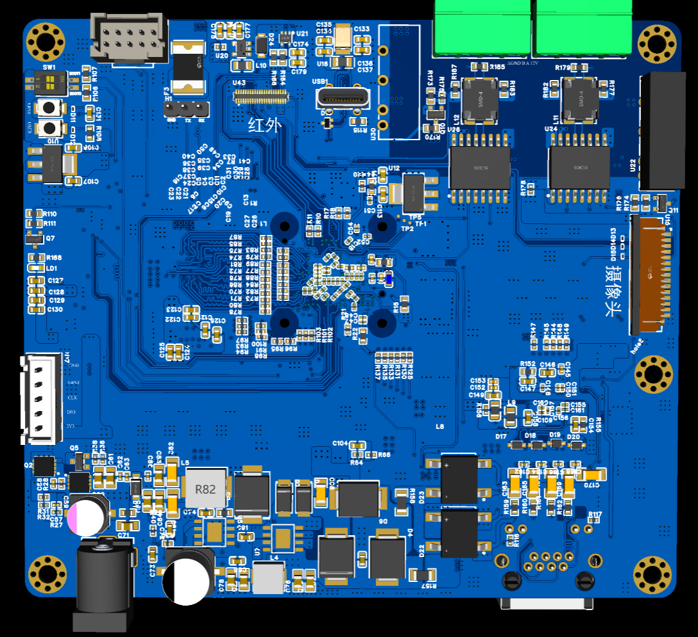
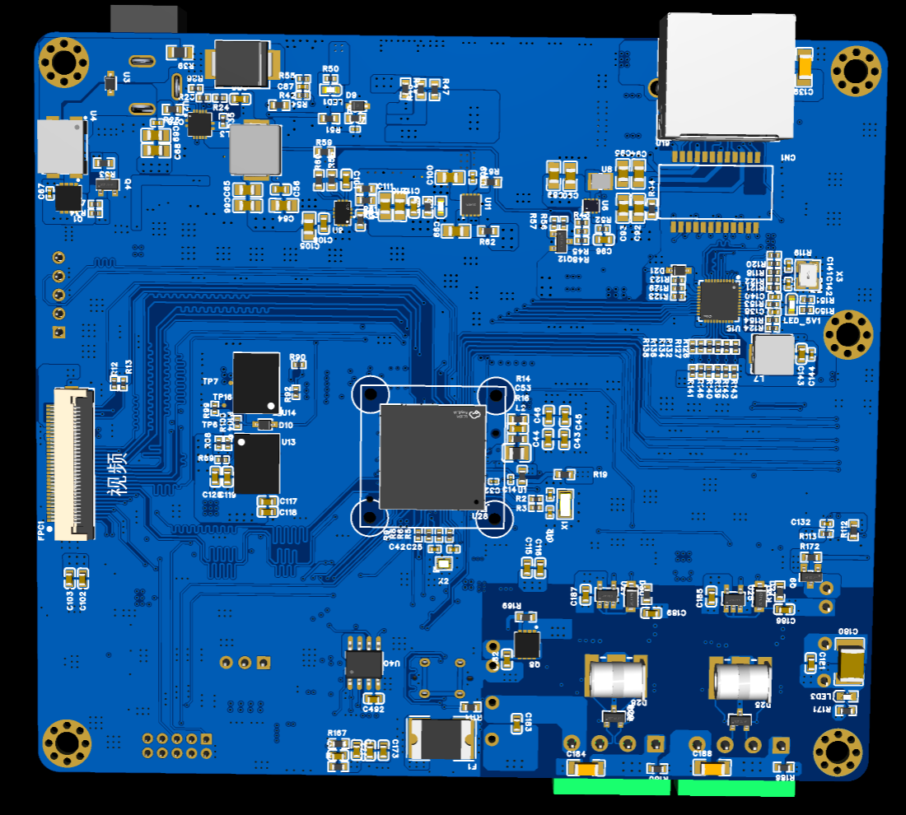

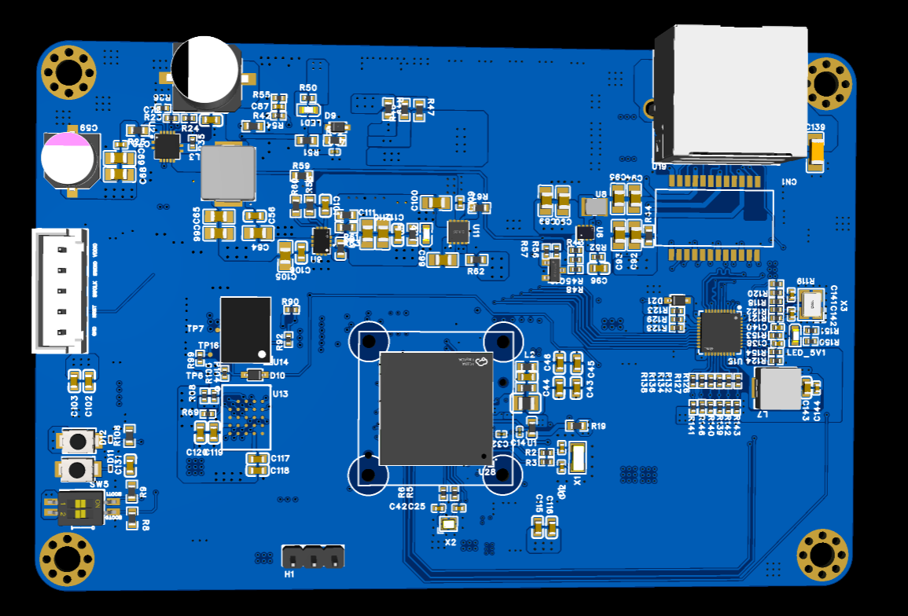
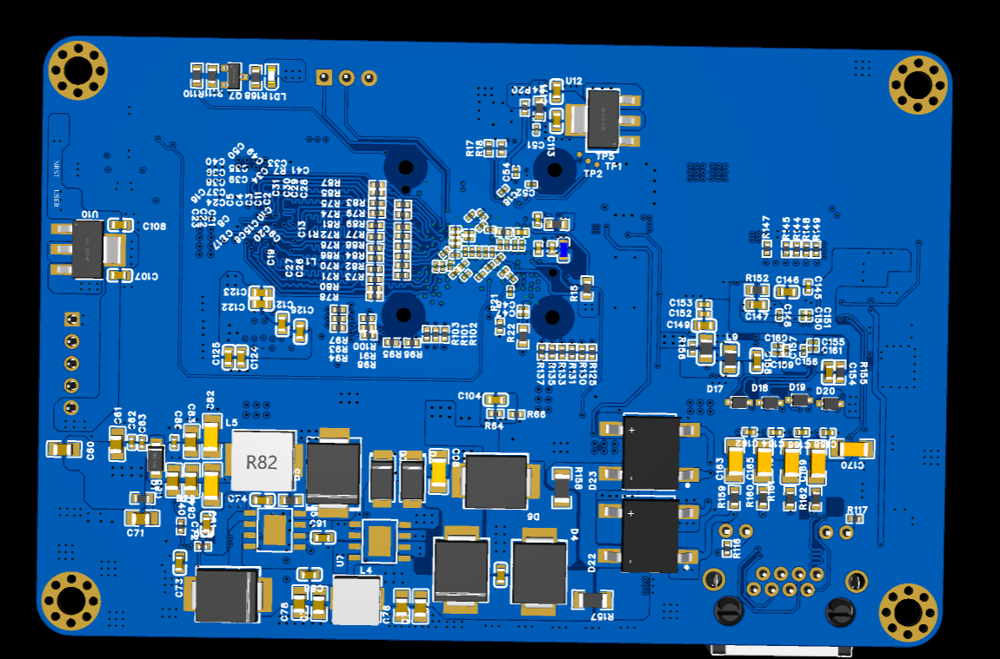

## 三、红外与可见光摄像头进展


- 红外摄像头功能已经实现，完成了红外采集链路的基础功能验证。
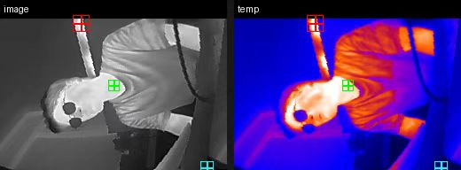
- 可见光摄像头功能完成进一步优化，为后续接入统一工程和多模态数据处理做准备。


这部分工作使系统从单一模拟量采集，扩展到“波形数据 + 红外图像 + 可见光图像 + 以太网控制”的多传感器方向。

## 四、以太网协议部署

STM32N6 端以太网基于 ThreadX + NetX Duo 完成部署，当前网络参数和服务如下：

| 项目 | 当前配置 |
| --- | --- |
| IP 地址 | `192.168.6.50` |
| 子网掩码 | `255.255.255.0` |
| TCP 命令端口 | `5000` |
| UDP echo 端口 | `5005` |
| PHY | RTL8211F |
| 网络协议栈 | NetX Duo |
| RTOS | ThreadX |

已完成的以太网能力：

- TCP 服务可正常连接。
- `PING` 命令返回 `PONG`，用于快速验证 TCP 服务。
- UDP echo 服务已部署，可作为轻量级链路测试工具。
- 修复并保护了 RTL8211F PHY 相关配置，包括 RXC 输出、100M full 自协商限制、TX/RX delay、EEE 关闭等关键项。
- 建立了以太网 baseline 自动检查脚本，防止后续合并过程中误改已验证配置。
- 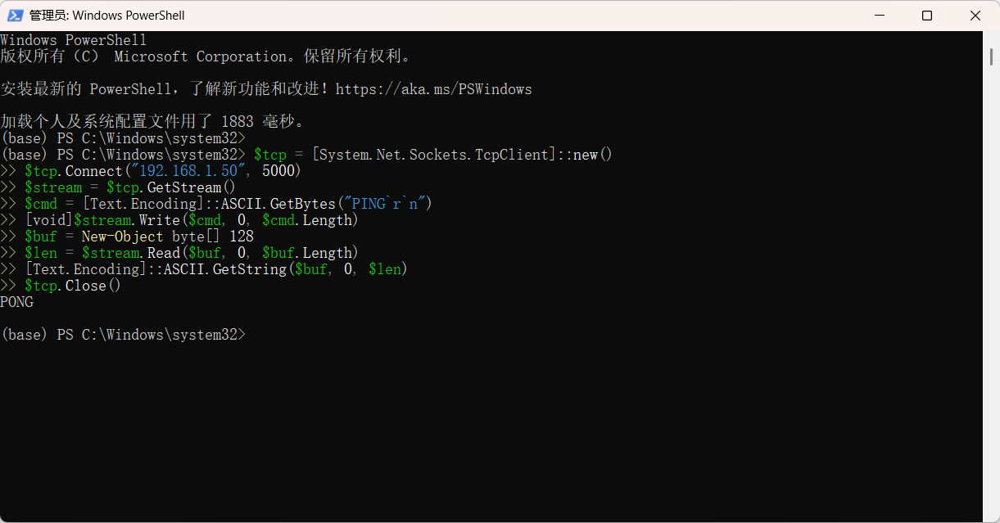

当前以太网 baseline 检查结果：

```text
Ethernet baseline check: 41 passed, 0 warnings, 0 failures.
```

## 五、工程合并进展

当前合并目标工程为：

```text
fsbl_appli_all
```

已经完成的合并内容：

- 从 `fsbl_appli_Ethernet` 移植并验证以太网相关代码。
- 从 `fsbl_appli_lrun` 移植 AD7606 SPI DMA 数据接收模块。
- 在 `fsbl_appli_all` 中统一使用 ThreadX 进行任务调度。
- 保留 NetX Duo 作为以太网协议栈。
- 增加 AD7606 独立采集线程，避免阻塞 NetX 网络服务。
- 增加统一 HAL callback 分发层，为后续红外、可见光摄像头等模块继续合并留出接口。
- 当前合并进度已经完成到“以太网 + AD7606 数据接收 + TCP 命令联动”阶段。

当前线程分工如下：

| 模块 | 作用 |
| --- | --- |
| NetX IP 线程 | 以太网协议栈核心处理 |
| TCP command 线程 | 接收上位机控制命令 |
| UDP echo 线程 | UDP 通信测试 |
| NetX link/status 线程 | 链路状态维护与状态输出 |
| AD7606 线程 | SPI DMA 数据接收、包解析、质量统计 |


## 六、AD7606 数据接收验证

AD7606 当前通过以下硬件链路接入 STM32N6：

| 功能 | STM32N6 资源 |
| --- | --- |
| SPI 接口 | SPI4 |
| RX DMA | GPDMA1 Channel 11 |
| TX DMA | GPDMA1 Channel 10 |
| 数据就绪中断 | PE8 / EXTI8 |
| 片选信号 | PB0 / AD_CS |

AD7606 原始波形包格式已验证：

- 每包总长度：`8240 bytes`
- payload 长度：`8212 bytes`
- 每包采样点数：`512`
- 通道数：`8`
- 每个采样点：`int16`
- 原始波形模式类型：`0x01`
- CRC32 校验通过

稳定运行时串口质量统计示例：

```text
SPI4 quality win=5000ms frame=251 crc_ok=251 crc_bad=0 dma_err=0 bad_hdr=0 bad_len=0 len_warn=0 Bps=413648
SPI4 quality gap irq=0 max_irq_delta=0 seq=0 max_seq_delta=0 raw_gap=0 max_raw_gap=0 raw_bad=0
```
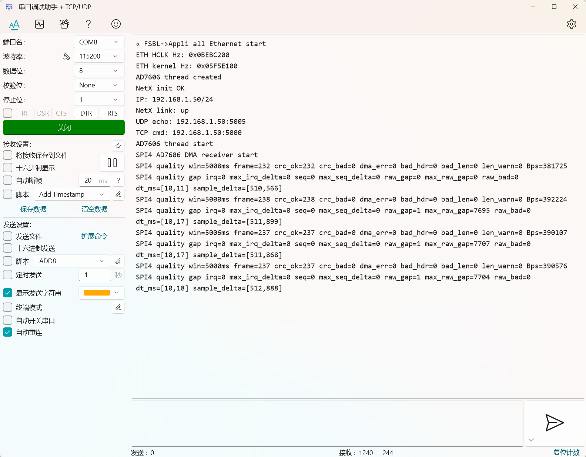
从结果看：

- CRC 错误为 0。
- DMA 错误为 0。
- 包头错误为 0。
- 包长度错误为 0。
- IRQ gap 为 0。
- seq gap 为 0。
- raw block gap 为 0。

说明 AD7606 采集卡到 STM32N6 的 SPI DMA 数据链路已经稳定跑通。

## 七、以太网与 AD7606 联动验证

当前已经实现 TCP 命令触发 AD7606 原始包解析。

上位机通过 TCP 连接：

```text
192.168.6.50:5000
```

发送命令：

```text
ADRAW
```

STM32N6 返回：

```text
OK AD7606 raw dump armed
```

随后 AD7606 线程在下一帧 CRC 正确的原始波形包到来时，通过串口输出该包的解析结果，包括：

- frame 序号
- timestamp
- sample counter
- payload 长度
- raw block 起止编号
- CH4 最小值、最大值、平均值
- 前若干行 8 通道原始采样值
- CH4 前若干个采样点

这说明以太网 TCP 控制链路已经可以和 AD7606 采集链路形成联动。
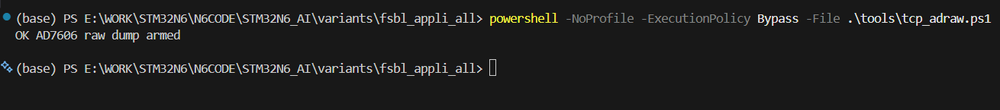
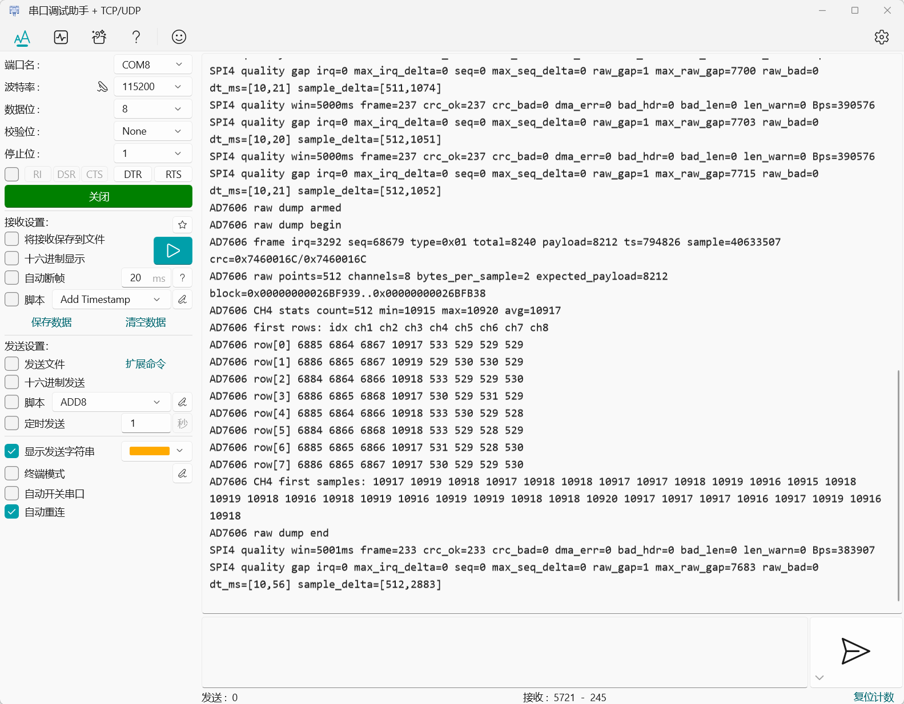
## 八、3V3 输入实测结果

为了验证采集数据是否来自真实硬件输入，将 AD7606 采集卡第 4 通道连接到 STM32N6 板上的 `3V3` 接口。

串口输出关键结果：

```text
AD7606 CH4 stats count=512 min=10916 max=10922 avg=10918
AD7606 CH4 first samples: 10917 10918 10919 10919 10920 ...
```

如果 AD7606 当前量程按常见的 `±10V` 双极性输入估算：

```text
10918 / 32768 * 10V ≈ 3.33V
```

该结果与实际接入的 `3V3` 电压基本一致，说明：

- 第 4 通道确实接收到了真实模拟输入。
- AD7606 数据包通道顺序解析正确。
- `int16` 小端原始数据解析正确。
- AD7606 到 STM32N6 的采集链路具备后续接入 AI 分析的基础。

## 九、当前阶段成果

本阶段已经完成以下关键成果：

1. 完成带以太网 PoE 接口的 AD7606 采集卡设计与生产。
2. 完成两版 STM32N6 板卡生产：智能传感器版本和 AI 推理版本。
3. 完成红外摄像头功能实现。
4. 完成可见光摄像头功能进一步优化。
5. 完成 STM32N6 端以太网 TCP/UDP 服务部署。
6. 完成以太网工程与 AD7606 数据接收工程的合并。
7. 完成 ThreadX 多线程调度框架接入。
8. 完成 AD7606 SPI DMA 接收、CRC 校验、质量统计。
9. 完成 TCP 命令触发 AD7606 raw dump 的联动验证。
10. 使用 3V3 输入验证了 AD7606 第 4 通道接收真实数据。
11. 建立以太网 baseline 检查脚本，降低后续合并风险。

## 十、下一步计划

后续工作包括：

1. 将 AD7606 raw dump 从串口调试输出进一步扩展为 TCP 数据回传。
2. 增加 AD7606 最新数据缓存接口，为 NPU AI 分析提供输入窗口。
3. 将 AD7606 数据整理为模型需要的 8 通道输入格式。
4. 开始恢复并合并 LRUN 工程中的 NPU 推理模块。
5. 将已经实现的红外摄像头功能合并到 `fsbl_appli_all`。
6. 将优化后的可见光摄像头功能纳入统一工程。
7. 基于智能传感器版本 STM32N6 板卡，验证 PoE 以太网、红外、可见光、AD7606 多模块同时工作。
8. 基于 AI 推理版本 STM32N6 板卡，验证轻量化硬件平台上的 NPU 推理和以太网控制链路。
9. 做长时间稳定性测试，包括以太网通信和 AD7606 持续采集同时运行。
10. 对 AD7606 各通道进行标定，明确量程、零点、比例系数和噪声水平。

## 十一、汇报总结

当前工作已经覆盖硬件设计生产、底层通信协议部署、采集链路验证和多工程合并几个关键环节。硬件方面，已经完成 PoE AD7606 采集卡，以及智能传感器版本和 AI 推理版本两类 STM32N6 板卡生产。软件方面，已经完成以太网 TCP/UDP 部署、AD7606 SPI DMA 接收，以及 TCP 命令触发 AD7606 原始波形解析的联动验证。

同时，红外摄像头功能已经实现，可见光摄像头功能也完成进一步优化。下一阶段工作的重点，是把已经验证过的独立模块逐步合并到 `fsbl_appli_all`，形成以 STM32N6 为核心，集成 PoE 以太网、AD7606、红外摄像头、可见光摄像头和 NPU AI 推理能力的统一智能传感器工程。
